# 🎙️ Voice AI Agent - Complete Project Documentation

## 📋 Table of Contents
1. [Project Overview](#project-overview)
2. [Architecture & Workflow](#architecture--workflow)
3. [Technology Stack](#technology-stack)
4. [Detailed Component Breakdown](#detailed-component-breakdown)
5. [Advantages](#advantages)
6. [Limitations](#limitations)
7. [Room for Improvement](#room-for-improvement)
8. [Setup & Deployment](#setup--deployment)

---

## 🎯 Project Overview

**Voice AI Agent** is a real-time voice-enabled conversational AI assistant that allows users to interact with advanced language models through natural speech. The application provides a seamless voice-to-voice interaction experience using modern web technologies and cloud-based AI services.

### Key Features
- 🎤 **Real-time voice recording** using browser's MediaRecorder API
- 🔊 **Speech-to-Text** transcription via Deepgram API
- 🧠 **AI-powered responses** from GitHub Models (GPT-4o, Llama 3.3)
- 🗣️ **Text-to-Speech** output using Web Speech API
- 🎨 **Premium glassmorphic UI** with smooth animations
- ⚡ **Fast response times** with efficient processing pipeline

---

## 🏗️ Architecture & Workflow

### System Architecture Diagram

```mermaid
graph TB
    subgraph "Client Browser"
        A[User Interface] --> B[MediaRecorder API]
        B --> C[Audio Blob]
        C --> D[FormData]
        K[Web Speech API] --> L[Audio Output 🔊]
    end
    
    subgraph "Flask Backend"
        E[/process-audio Endpoint]
        F[Audio Processing]
    end
    
    subgraph "External Services"
        G[Deepgram API<br/>Speech-to-Text]
        H[GitHub Models<br/>Azure OpenAI]
    end
    
    D -->|POST Request| E
    E --> F
    F -->|Audio Data| G
    G -->|Transcript| F
    F -->|User Text| H
    H -->|AI Response| F
    F -->|JSON Response| A
    A -->|Agent Reply| K
    
    style A fill:#667eea,stroke:#764ba2,stroke-width:2px,color:#fff
    style G fill:#f093fb,stroke:#f5576c,stroke-width:2px,color:#fff
    style H fill:#4facfe,stroke:#00f2fe,stroke-width:2px,color:#fff
    style K fill:#43e97b,stroke:#38f9d7,stroke-width:2px,color:#fff
```

### Complete Workflow Sequence

```mermaid
sequenceDiagram
    participant U as User
    participant UI as Frontend UI
    participant MR as MediaRecorder
    participant Flask as Flask Server
    participant DG as Deepgram API
    participant AI as GitHub Models
    participant TTS as Web Speech API

    U->>UI: Click Microphone Button
    UI->>MR: Start Recording
    MR-->>UI: Status: "Listening..."
    
    U->>MR: Speaks into microphone
    Note over MR: Recording audio...
    
    U->>UI: Click Stop Button
    UI->>MR: Stop Recording
    MR->>UI: Audio Blob (WebM/Opus)
    
    UI->>Flask: POST /process-audio<br/>(audio + model choice)
    Note over Flask: Processing request...
    
    Flask->>DG: Send Audio Data
    DG->>DG: Transcribe (Nova-3 Model)
    DG-->>Flask: Transcript Text
    
    Flask->>AI: Send Transcript<br/>(with system prompt)
    AI->>AI: Generate Response<br/>(GPT-4o/Llama)
    AI-->>Flask: AI Response Text
    
    Flask-->>UI: JSON {transcript, agent_reply}
    
    UI->>UI: Update Display<br/>(User text + Agent text)
    UI->>TTS: speak(agent_reply)
    TTS->>TTS: Convert Text to Speech
    TTS-->>U: Play Audio 🔊
    
    Note over UI: Status: "Ready"
```



### Data Flow Diagram


### Component Interaction Map


---

## 🛠️ Technology Stack

### Frontend Technologies

| Technology | Purpose | Version/Source |
|------------|---------|----------------|
| **HTML5** | Structure & Semantic Markup | Native |
| **CSS3** | Styling with Glassmorphism | Native |
| **JavaScript (ES6+)** | Client-side Logic | Native |
| **MediaRecorder API** | Audio Recording | Browser Native |
| **Web Speech API** | Text-to-Speech | Browser Native |
| **Lucide Icons** | UI Icons | CDN (unpkg) |
| **Google Fonts (Outfit)** | Typography | CDN |

### Backend Technologies

| Technology | Purpose | Version |
|------------|---------|---------|
| **Python** | Backend Language | 3.8+ |
| **Flask** | Web Framework | Latest |
| **python-dotenv** | Environment Variables | Latest |
| **Deepgram SDK** | Speech-to-Text | Latest |
| **OpenAI SDK** | LLM Integration | Latest |

### External Services

| Service | Purpose | Model/Version |
|---------|---------|---------------|
| **Deepgram** | Speech-to-Text Transcription | Nova-3 |
| **GitHub Models** | AI Language Models | GPT-4o, Llama 3.3, GPT-4o-mini |
| **Azure OpenAI** | LLM Hosting | Via GitHub Models |

---

## 🔍 Detailed Component Breakdown

### 1. Frontend Components

#### **index.html**
```
Purpose: Main UI structure
Key Elements:
  - Glassmorphic card design
  - Microphone button with visualizer ring
  - Model selection dropdown
  - Transcript & response display areas
  - Animated background blobs
```

#### **script.js**
```
Purpose: Client-side interaction logic
Key Functions:
  - startRecording(): Captures audio from microphone
  - stopRecording(): Stops audio capture
  - handleRecordingStop(): Processes and sends audio to backend
  - speak(): Converts AI response to speech
  
Key Variables:
  - mediaRecorder: MediaRecorder instance
  - audioChunks: Array of audio data
  - audioStream: MediaStream from microphone
```

#### **style.css**
```
Purpose: Premium visual design
Key Features:
  - CSS custom properties for theming
  - Glassmorphism effects
  - Smooth animations and transitions
  - Responsive design
  - Gradient backgrounds
```

### 2. Backend Components

#### **app.py**
```
Purpose: Flask server and API endpoints
Key Routes:
  - GET /: Serves index.html
  - POST /process-audio: Handles voice processing
  
Key Functions:
  - Audio file reception
  - Deepgram transcription
  - GitHub Models AI response
  - Error handling
```

### 3. API Integration Flow


---

## ✅ Advantages

### Technical Advantages


### Detailed Advantages

#### 🚀 **Performance**
- **Fast transcription** with Deepgram's Nova-3 model (< 1 second for typical queries)
- **Instant TTS** using browser-native speech synthesis (no network delay)
- **Efficient audio encoding** with WebM/Opus compression
- **Asynchronous processing** prevents UI blocking

#### 💰 **Cost Efficiency**
- **Zero TTS costs** - uses browser's built-in speech synthesis
- **Affordable STT** - Deepgram offers competitive pricing
- **Free tier available** for GitHub Models
- **Minimal server resources** - stateless Flask application

#### 🎨 **User Experience**
- **Natural voice interaction** - feels like talking to a human
- **Premium visual design** - glassmorphism and smooth animations
- **Real-time status updates** - users always know what's happening
- **Multiple AI models** - users can choose intelligence level
- **Cross-platform compatibility** - works on all modern browsers

#### 🔧 **Development & Maintenance**
- **Simple architecture** - easy to understand and modify
- **Modular design** - components are loosely coupled
- **Well-documented APIs** - Deepgram and OpenAI have excellent docs
- **Standard technologies** - Flask, JavaScript, HTML/CSS
- **Easy debugging** - clear error messages and logging

#### 📈 **Scalability**
- **Stateless backend** - easy to scale horizontally
- **API-based services** - offloads heavy processing to cloud
- **No session management** - each request is independent
- **Cloud-ready** - can deploy to any platform (Heroku, AWS, Azure)

---

## ⚠️ Limitations

### Current Limitations Matrix


### Detailed Limitations

#### 🔊 **Audio Quality**
- **Variable TTS quality** - depends on user's browser and OS
- **No voice customization** - can't control pitch, speed, or accent
- **Different voices** across platforms - inconsistent experience
- **No audio effects** - can't add emotion or emphasis

#### 💬 **Conversation Management**
- **No conversation history** - each interaction is isolated
- **No context retention** - AI doesn't remember previous questions
- **No multi-turn dialogues** - can't have complex conversations
- **No conversation export** - can't save or review past interactions

#### 🌐 **Language & Localization**
- **English only** - hardcoded language settings
- **No multi-language support** - can't switch languages
- **No accent detection** - may struggle with non-native speakers
- **No regional customization** - same experience for all users

#### 🔒 **Security & Privacy**
- **API keys in .env** - not suitable for production
- **No authentication** - anyone can access the application
- **No rate limiting** - vulnerable to abuse
- **No input sanitization** - potential security risks
- **Audio data sent to cloud** - privacy concerns

#### 🎯 **User Experience**
- **Manual recording control** - no automatic voice detection
- **No interrupt capability** - can't stop AI mid-speech
- **No visual feedback** during processing - limited progress indication
- **No error recovery** - must restart on failure

#### 📱 **Platform Support**
- **Desktop-optimized** - mobile experience not fully tested
- **Browser-dependent** - features vary by browser
- **No offline mode** - requires internet connection
- **No PWA support** - can't install as app

---

## 🚀 Room for Improvement

### Enhancement Roadmap


### Priority Improvements

#### 🔥 **High Priority (Quick Wins)**

##### 1. **Conversation History**
```python
# Implementation Approach
- Add session management with Flask-Session
- Store conversation in memory/Redis
- Pass conversation context to AI model
- Display chat history in UI

Benefits:
✅ Better AI responses with context
✅ Multi-turn conversations
✅ User can review past interactions
```

##### 2. **Voice Activity Detection (VAD)**
```javascript
// Implementation Approach
- Use Web Audio API to analyze audio levels
- Auto-start/stop recording based on voice detection
- Implement silence detection for auto-stop

Benefits:
✅ Hands-free operation
✅ Better user experience
✅ No manual button clicking
```

##### 3. **Error Recovery & Retry Logic**
```python
# Implementation Approach
- Add try-except blocks with retry logic
- Implement exponential backoff
- Provide user-friendly error messages
- Add fallback mechanisms

Benefits:
✅ More robust application
✅ Better error handling
✅ Improved reliability
```

##### 4. **Loading States & Progress Indicators**
```javascript
// Implementation Approach
- Add skeleton loaders
- Show processing stages (Recording → Transcribing → Thinking → Speaking)
- Implement progress bars
- Add animated indicators

Benefits:
✅ Better user feedback
✅ Reduced perceived wait time
✅ Professional appearance
```

#### ⭐ **Medium Priority (Feature Enhancements)**

##### 5. **Premium TTS Integration**
```python
# Options:
- ElevenLabs API (most natural voices)
- Google Cloud TTS (multi-language)
- Azure Speech Services (enterprise-grade)
- Amazon Polly (cost-effective)

Benefits:
✅ Consistent voice quality
✅ Emotional expression
✅ Voice customization
✅ Multi-language support
```

##### 6. **Multi-Language Support**
```python
# Implementation Approach
- Add language selector in UI
- Configure Deepgram for multi-language
- Update AI prompts for language context
- Implement i18n for UI text

Benefits:
✅ Global accessibility
✅ Wider user base
✅ Better transcription accuracy
```

##### 7. **User Authentication & Profiles**
```python
# Implementation Approach
- Implement JWT authentication
- Add user registration/login
- Store user preferences
- Track usage statistics

Benefits:
✅ Personalized experience
✅ Usage tracking
✅ Security improvement
✅ Feature gating
```

##### 8. **Database Integration**
```python
# Implementation Approach
- Use PostgreSQL/MongoDB for storage
- Store conversation history
- Save user preferences
- Track analytics data

Benefits:
✅ Persistent data
✅ Advanced analytics
✅ User history
✅ Better insights
```

#### 🎯 **Low Priority (Nice to Have)**

##### 9. **Mobile App (PWA)**
```javascript
// Implementation Approach
- Add service worker
- Create manifest.json
- Implement offline caching
- Add install prompt

Benefits:
✅ App-like experience
✅ Offline capability
✅ Push notifications
✅ Better mobile UX
```

##### 10. **Analytics Dashboard**
```python
# Implementation Approach
- Track usage metrics
- Monitor API costs
- Analyze user behavior
- Generate reports

Benefits:
✅ Data-driven decisions
✅ Cost optimization
✅ User insights
✅ Performance monitoring
```

##### 11. **Voice Cloning**
```python
# Implementation Approach
- Integrate ElevenLabs Voice Cloning
- Allow users to upload voice samples
- Generate custom AI voices
- Store voice profiles

Benefits:
✅ Personalized voices
✅ Brand consistency
✅ Unique user experience
```

##### 12. **Advanced AI Features**
```python
# Implementation Approach
- Function calling for actions
- RAG for knowledge base
- Memory for long-term context
- Multi-modal inputs (images, files)

Benefits:
✅ More capable assistant
✅ Task automation
✅ Better responses
✅ Expanded use cases
```

### Technical Debt & Refactoring


---

## 🔧 Setup & Deployment

### Local Development Setup


### Step-by-Step Setup

```bash
# 1. Clone the repository
git clone <repository-url>
cd voice_ai_agent

# 2. Create virtual environment
python -m venv .venv

# 3. Activate virtual environment
# Windows:
.venv\Scripts\activate
# macOS/Linux:
source .venv/bin/activate

# 4. Install dependencies
pip install -r requirements.txt

# 5. Configure environment variables
# Create .env file with:
GITHUB_TOKEN=your_github_token_here
DEEPGRAM_API_KEY=your_deepgram_key_here
DEBUG=True

# 6. Run the application
python src/voice_ai_agent/app.py

# 7. Open browser
# Navigate to: http://localhost:5000
```

### Environment Variables

| Variable | Purpose | How to Get |
|----------|---------|------------|
| `GITHUB_TOKEN` | Access GitHub Models (Azure OpenAI) | GitHub Settings → Developer Settings → Personal Access Tokens |
| `DEEPGRAM_API_KEY` | Speech-to-Text transcription | https://console.deepgram.com → API Keys |
| `DEBUG` | Enable Flask debug mode | Set to `True` for development |

### Production Deployment Considerations


#### Production Requirements

1. **Security**
   - Use environment variable management (AWS Secrets Manager, Azure Key Vault)
   - Implement HTTPS/SSL certificates
   - Add CORS protection
   - Implement rate limiting
   - Add input validation and sanitization

2. **Performance**
   - Use production WSGI server (Gunicorn, uWSGI)
   - Implement caching (Redis)
   - Use CDN for static assets
   - Enable gzip compression
   - Optimize database queries

3. **Monitoring**
   - Add error tracking (Sentry)
   - Implement logging (CloudWatch, Datadog)
   - Set up uptime monitoring
   - Track API usage and costs
   - Monitor performance metrics

4. **Scalability**
   - Use load balancer
   - Implement horizontal scaling
   - Add database connection pooling
   - Use message queue for async tasks
   - Implement caching strategy

---

## 📊 Project Metrics

### Current State


### File Structure

```
voice_ai_agent/
├── .env                          # Environment variables
├── .gitignore                    # Git ignore rules
├── requirements.txt              # Python dependencies
├── README.md                     # Basic project info
├── PROJECT_DOCUMENTATION.md      # This file
├── API_VERIFICATION_REPORT.md    # API testing results
├── test_payload.json             # Test data
├── test_complete_flow.py         # Integration tests
├── test_github_api.py            # API tests
├── .venv/                        # Virtual environment
├── tests/                        # Test files
└── src/
    └── voice_ai_agent/
        ├── app.py                # Flask backend
        ├── templates/
        │   └── index.html        # Main UI
        └── static/
            ├── css/
            │   └── style.css     # Styling
            └── js/
                └── script.js     # Client logic
```

---

## 🎓 Learning Resources

### For Understanding This Project

1. **Flask Documentation**: https://flask.palletsprojects.com/
2. **Deepgram API Docs**: https://developers.deepgram.com/
3. **OpenAI API Guide**: https://platform.openai.com/docs/
4. **Web Speech API**: https://developer.mozilla.org/en-US/docs/Web/API/Web_Speech_API
5. **MediaRecorder API**: https://developer.mozilla.org/en-US/docs/Web/API/MediaRecorder

### For Extending This Project

1. **Flask-Session**: For conversation history
2. **Redis**: For caching and session storage
3. **PostgreSQL**: For persistent data storage
4. **ElevenLabs**: For premium TTS
5. **LangChain**: For advanced AI features

---

## 📝 Conclusion

This Voice AI Agent project demonstrates a **clean, efficient architecture** for building voice-enabled AI applications. While it has some limitations, the modular design makes it easy to extend and improve.

### Key Takeaways

✅ **Simple yet powerful** - Does one thing well
✅ **Cost-effective** - Uses free/affordable services
✅ **Easy to understand** - Clear code structure
✅ **Production-ready foundation** - Can be scaled up
✅ **Modern tech stack** - Uses latest APIs and best practices

### Next Steps

1. **Immediate**: Add conversation history and error recovery
2. **Short-term**: Implement authentication and database
3. **Long-term**: Add advanced AI features and mobile support

---

**Created**: 2026-01-29  
**Version**: 1.0  
**Author**: Voice AI Agent Team  
**License**: MIT
