# 🔄 Voice AI Agent - Visual Block Diagrams

## 1. Master Process Flowchart (Detailed Logic)

This flowchart represents the **exact logical path** the data takes through the entire application, including decision points and error handling.

```mermaid
graph TD
    %% Nodes Configuration
    classDef terminal fill:#f9f,stroke:#333,stroke-width:2px;
    classDef process fill:#e1f5fe,stroke:#0277bd,stroke-width:2px;
    classDef decision fill:#fff9c4,stroke:#fbc02d,stroke-width:2px;
    classDef io fill:#e8f5e9,stroke:#2e7d32,stroke-width:2px;

    Start((Start)):::terminal
    End((End)):::terminal

    %% Frontend Phase
    subgraph Frontend_Logic [Client Side]
        UserAction[User Clicks Record]:::io
        RecStart[Start MediaRecorder]:::process
        UserSpeak[User Speaks...]:::io
        UserStop[User Clicks Stop]:::io
        CreateBlob[Create Audio Blob]:::process
        PrepareReq[Prepare FormData]:::process
    end

    %% Transmission
    SendReq[POST /process-audio]:::io

    %% Backend Phase
    subgraph Backend_Logic [Server Side]
        ReceiveReq[Receive Request]:::process
        CheckFile{Has Audio File?}:::decision
        ReturnError1[Return 400 Error]:::process
        
        ReadAudio[Read Audio Data]:::process
        
        %% Deepgram Step
        CallDG[Call Deepgram API]:::process
        DGSuccess{Transcription Success?}:::decision
        ExtractText[Extract Transcript]:::process
        CheckText{Is Text Empty?}:::decision
        SetDefault[Set Reply: 'Could not hear you']:::process
        
        %% AI Step
        CallAI[Call GitHub Models]:::process
        GenReply[Generate Agent Reply]:::process
    end

    %% Response Phase
    BuildJSON[Build JSON Response]:::process
    SendResp[Return to Client]:::io

    %% Client Execution
    subgraph Client_Execution [Browser Output]
        ParseResp[Parse JSON]:::process
        UpdateUI[Update Transcript & Agent Text]:::process
        HasReply{Has Agent Reply?}:::decision
        CallTTS[Call speak]:::process
        BrowserTTS[Browser TTS Engine Plays Audio]:::io
    end

    %% Connections
    Start --> UserAction
    UserAction --> RecStart
    RecStart --> UserSpeak
    UserSpeak --> UserStop
    UserStop --> CreateBlob
    CreateBlob --> PrepareReq
    PrepareReq --> SendReq
    
    SendReq --> ReceiveReq
    ReceiveReq --> CheckFile
    
    CheckFile -- No --> ReturnError1
    CheckFile -- Yes --> ReadAudio
    
    ReadAudio --> CallDG
    CallDG --> DGSuccess
    
    DGSuccess -- Error --> SetDefault
    DGSuccess -- Success --> ExtractText
    
    ExtractText --> CheckText
    CheckText -- Empty --> SetDefault
    CheckText -- Valid Text --> CallAI
    
    CallAI --> GenReply
    GenReply --> BuildJSON
    SetDefault --> BuildJSON
    
    BuildJSON --> SendResp
    ReturnError1 --> SendResp
    
    SendResp --> ParseResp
    ParseResp --> UpdateUI
    UpdateUI --> HasReply
    
    HasReply -- Yes --> CallTTS
    CallTTS --> BrowserTTS
    BrowserTTS --> End
    HasReply -- No --> End

```



## 2. Nested System Component Map

This diagram visualizes exactly what happens **inside** each logical container.

```mermaid
graph TB
    subgraph Browser_Environment [💻 USER'S BROWSER]
        direction TB
        style Browser_Environment fill:#e3f2fd,stroke:#1565c0,stroke-width:2px,color:#000
        
        UI[User Interface] 
        style UI fill:#fff,stroke:#333
        
        subgraph JS_Logic [JavaScript Engine]
            style JS_Logic fill:#fff,stroke:#333,stroke-dasharray: 5 5
            Rec[MediaRecorder API]
            Handler[Event Handlers]
            TTS[Web Speech API]
        end
        
        UI -- Click Record --> Rec
        Rec -- Audio Blob --> Handler
        Handler -- Speak Command --> TTS
    end

    subgraph Server_Environment [⚙️ FLASK BACKEND SERVER]
        direction TB
        style Server_Environment fill:#f3e5f5,stroke:#7b1fa2,stroke-width:2px,color:#000
        
        API_Route[/process-audio Endpoint]
        style API_Route fill:#fff,stroke:#333
        
        subgraph Python_Logic [App Logic]
            style Python_Logic fill:#fff,stroke:#333,stroke-dasharray: 5 5
            Env_Loader[Load .env Keys]
            DG_Client[Deepgram Client]
            GH_Client[OpenAI Client]
        end
        
        API_Route --> Env_Loader
        Env_Loader --> DG_Client
        DG_Client --> GH_Client
    end

    subgraph Cloud_Infrastructure [☁️ EXTERNAL CLOUD APIS]
        direction TB
        style Cloud_Infrastructure fill:#e8f5e9,stroke:#2e7d32,stroke-width:2px,color:#000
        
        Deepgram_Cloud[Deepgram Nova-3 Model]
        Azure_Cloud[Azure / GitHub Models]
    end

    %% Connections between large blocks
    Handler == HTTP POST (Audio) ==> API_Route
    DG_Client == Audio Stream ==> Deepgram_Cloud
    Deepgram_Cloud == Text Transcript ==> DG_Client
    GH_Client == Prompt + Transcript ==> Azure_Cloud
    Azure_Cloud == AI Response ==> GH_Client
    
    %% Final Response Path
    GH_Client -. JSON Payload .-> Handler
```
